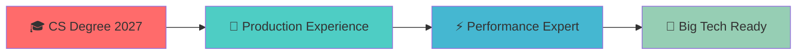

<div align="center">
  
</div>

<div align="center">
  
</div>

<h1 align="center">
  
  Welcome to my Digital Playground!
  
</h1>

<div align="center">
  
  
  
</div>

## 🎖️ Key Achievements & Impact

<div align="center">
  
| 🎯 **Metric** | 📊 **Achievement** | 🚀 **Context** |
|---------------|-------------------|----------------|
| **Performance** | 40% load time reduction | High-traffic consumer platforms |
| **Scale** | 10K+ daily users | Production applications |
| **Deployment** | 60% faster CI/CD | Automated pipeline optimization |
| **Leadership** | 300+ students mentored | Campus community building |
| **Experience** | 3 tech internships | Diverse industry exposure |

</div>

---

## 🚀 About Me

```javascript
const robert = {
    pronouns: "he/him",
    location: "Centre College, Kentucky 🏫",
    currentFocus: "Full-Stack Development & System Architecture",
    yearOfGraduation: 2027,
    workingOn: "Building scalable web applications",
    learningNext: ["GraphQL", "Kubernetes", "Microservices"],
    askMeAbout: ["React", "Django", "System Design", "DevOps"],
    funFact: "I debug with console.log and I'm not ashamed! 🐛"
};
```

---

## 🛠️ Tech Arsenal

<div align="center">

### 🎨 Frontend Technologies
<p>
  
</p>

### ⚙️ Backend & Database
<p>
  
</p>

### ☁️ DevOps & Cloud
<p>
  
</p>

### 🔧 Tools & Others
<p>
  
</p>

</div>

---

## 📊 GitHub Analytics

<div align="center">
  
  
</div>

<div align="center">
  
</div>

<div align="center">
  
</div>

---

## 💼 Professional Journey

<div align="center">

| 🏢 Company | 👨‍💻 Role | 📅 Duration | 🔗 Highlights |
|------------|-----------|-------------|---------------|
| **Theta Zero Consulting** | Software Engineer Intern | Dec 2024 – Present | Full-stack development & CI/CD pipeline setup |
| **Novatek Technology JSC** | Software Engineer Intern | May 2024 – Nov 2024 | Performance optimization on high-traffic platforms |
| **Propvia** | Front-End Intern | Summer 2025 | Responsive UI components & dashboard experience |
| **Centre College** | IT Technician & RA | 2023 – Present | Campus systems maintenance & community leadership |

</div>

---

## 🎯 Current Goals

<div align="center">



</div>

- 🚀 **Building production-ready applications** that handle thousands of concurrent users
- 📈 **Passionate about performance optimization** - reduced load times by 40% across multiple projects
- 🤝 **Open to challenging full-time opportunities** starting Summer 2027
- 💡 **Love solving complex problems** through elegant, scalable solutions
- 🌟 **Seeking mentorship opportunities** at top-tier tech companies

---

## 🤝 Let's Connect & Collaborate!

<div align="center">
  <a href="https://www.linkedin.com/in/robert-nguyenn/" target="_blank">
    
  </a>
  <a href="mailto:robert.nguyenanh@gmail.com" target="_blank">
    
  </a>
  <a href="https://github.com/robert-nguyenn" target="_blank">
    
  </a>
  <a href="https://discord.com/users/your-discord-id" target="_blank">
    
  </a>
</div>

---

<div align="center">
  
</div>

<div align="center">
  
</div>

---

<div align="center">
  <sub>💡 <i>Always open to interesting conversations and collaboration opportunities!</i></sub>
</div>
