<div align="center">
  
</div>

<div align="center">
  
</div>

<h1 align="center">
  
  Welcome to my Digital Playground!
  
</h1>

<div align="center">
  
  
  
</div>

## 🎖️ Key Achievements & Impact

<div align="center">
  
| 🎯 **Metric** | 📊 **Achievement** | 🚀 **Context** |
|---------------|-------------------|----------------|
| **Performance** | 40% load time reduction | High-traffic consumer platforms |
| **Scale** | 10K+ daily users | Production applications |
| **Deployment** | 60% faster CI/CD | Automated pipeline optimization |
| **Leadership** | 500+ students mentored | Campus community building |
| **Experience** | 3 tech internships | Diverse industry exposure |

</div>

---

## 🚀 About Me

```javascript
const robert = {
    pronouns: "he/him",
    location: "Centre College, Kentucky 🏫",
    currentFocus: "Full-Stack Development & System Architecture",
    yearOfGraduation: 2027,
    workingOn: "Building scalable web applications",
    learningNext: ["GraphQL", "Kubernetes", "Microservices"],
    askMeAbout: ["React", "Django", "System Design", "DevOps"],
    funFact: "I debug with console.log and I'm not ashamed! 🐛"
};
```

---

## 🛠️ Tech Arsenal

<div align="center">

### 🤖 AI & Machine Learning
<p>
  
</p>

### 🎨 Frontend Technologies
<p>
  
</p>

### ⚙️ Backend & Database
<p>
  
</p>

### ☁️ DevOps & Cloud
<p>
  
</p>

### 🔧 Tools & Others
<p>
  
</p>

</div>

---

## 📊 GitHub Analytics

<div align="center">
  
  
</div>

<div align="center">
  
</div>

<div align="center">
  
</div>

---

## 💼 Professional Journey

<div align="center">

| 🏢 Company | 👨‍💻 Role | 📅 Duration | 🔗 Highlights |
|------------|-----------|-------------|---------------|
| **Propvia** | Software Engineer Intern | Jun 2025 - Sep 2025 | Building enterprise React components with advanced optimization techniques |
| **Theta Zero Consulting** | Software Engineer Intern | Dec 2024 – May 2025 | Full-stack development & CI/CD pipeline setup |
| **Novatek Technology JSC** | Software Engineer Intern | May 2024 – Nov 2024 | Performance optimization on high-traffic platforms |
| **Centre College** | Undergraduate Research Assistant | Jan 2024 - May 2024 | Built Python ML pipeline processing 100K+ soccer telemetry events with 98% accuracy |

</div>

---

## 🎯 Current Goals

```mermaid
graph LR
    A[🎓 CS Degree 2027] --> B[🚀 Production Experience]
    B --> C[⚡ Performance Expert]
    C --> D[🏢 Big Tech Ready]
    
    style A fill:#ff6b6b
    style B fill:#4ecdc4
    style C fill:#45b7d1
    style D fill:#96ceb4
```

<div align="center">



</div>

- 🚀 **Building production-ready applications** with intelligent features and AI integration
- 📈 **Performance optimization specialist** - consistently deliver 40%+ improvements in system efficiency
- 🤖 **Exploring AI applications** in web development and user experience enhancement
- 🤝 **Open to challenging full-time opportunities** starting Summer 2027
- 💡 **Love architecting scalable solutions** that handle enterprise-level traffic

---

## 🤝 Ready for Your Next Challenge?

<div align="center">
  
**🎯 Actively seeking Internship opportunities at innovative tech companies**

*Passionate about building scalable systems, optimizing performance, and integrating AI into user experiences*

  <a href="https://www.linkedin.com/in/robert-nguyenn/" target="_blank">
    
  </a>
  <a href="mailto:robert.nguyenanh@gmail.com" target="_blank">
    
  </a>
  <a href="https://github.com/robert-nguyenn" target="_blank">
    
  </a>
</div>

---

<div align="center">
  
</div>

<div align="center">
  
</div>

---

<div align="center">
  <sub>💡 <i>Always open to interesting conversations and collaboration opportunities!</i></sub>
</div>
